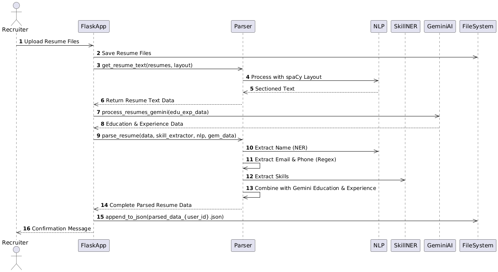
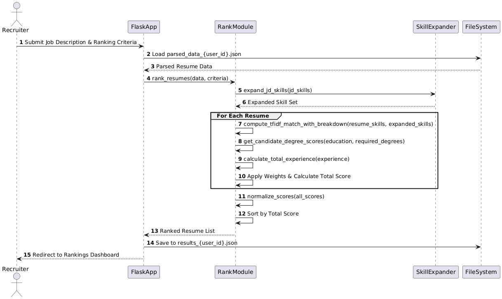

# AI-Powered Resume Screening System

## 📄 Overview
This application is a comprehensive AI-powered resume screening and ranking system. It intelligently parses, analyzes, and ranks resumes based on job descriptions, helping recruiters and hiring managers quickly identify the most qualified candidates.

---

## ✨ Features

### 🔍 Smart Resume Parsing
- **Automatic Data Extraction**: Extracts contact details, education, experience, and skills from PDF resumes.
- **AI-Powered Analysis**: Uses Gemini AI to understand complex resume sections.
- **Skills Recognition**: Integrates SkillNER for identifying technical and soft skills.

### 🧠 Advanced Resume Ranking
- **Customizable Weights**: Prioritize experience, education, or skills as needed.
- **Semantic Skill Matching**: Enhanced matching using AI-based context.
- **Education Filters**: Filter by degree types and minimum education scores.
- **Visualization**: Clear visual representation of candidate qualifications.

### 🖥️ User-Friendly Interface
- **Dashboard**: Manage uploaded resumes with ease.
- **Candidate Management**: View, analyze, and compare candidate profiles.
- **Detailed Resume View**: In-depth parsed data display.
- **Custom Ranking Parameters**: Fine-tune ranking criteria interactively.

### 🔒 Security and User Management
- **Secure Authentication**: Login system with password encryption.
- **User-Specific Data**: Data is isolated per user account.
- **API Key Protection**: Safely manage your Gemini AI API keys.

---

## 🛠️ Technology Stack

- **Backend**: Flask (Python)
- **NLP**: spaCy, spaCy-Layout, SkillNER
- **AI Integration**: Google Gemini AI (Generative AI)
- **Database**: SQLite with SQLAlchemy ORM
- **Authentication**: Flask-Login, Bcrypt
- **Frontend**: HTML, CSS, JavaScript

---

## 📊 Sequence Diagrams

The following sequence diagrams illustrate the process flow of the AI-powered resume screening and ranking system:

### 1. **Resume Parsing**
This diagram showcases the step-by-step flow of how resumes are parsed and key information is extracted.



### 2. **Resume Screening**
This diagram illustrates the process of how resumes are screened, ranked, and compared based on job descriptions and criteria.



---

## 🚀 Usage Guide

1. **Register/Login**: Create a user account and securely save your Gemini API key.
2. **Upload Resumes**: Upload one or more PDF resumes.
3. **Parse & Review**: View and verify extracted data.
4. **Enter Job Description**: Add desired skills and requirements.
5. **Configure Ranking**: Set weights for skills, experience, and education.
6. **View Results**: Review ranked candidate profiles with visual insights.


## 🤝 Contributing

Pull requests are welcome!

```bash
# Fork the repository
# Create a new branch
git checkout -b feature/AmazingFeature

# Commit your changes
git commit -m 'Add some AmazingFeature'

# Push to GitHub
git push origin feature/AmazingFeature
```
Open a Pull Request

## 📄 License
This project is licensed under the MIT License – see the LICENSE file for details.

## 🙏 Acknowledgments
- SkillNER for skill extraction
- spaCy for powerful NLP tools
- Google Generative AI (Gemini) for intelligent resume understanding
- Note: You must provide your own Gemini API key to use the AI-powered features.
#
